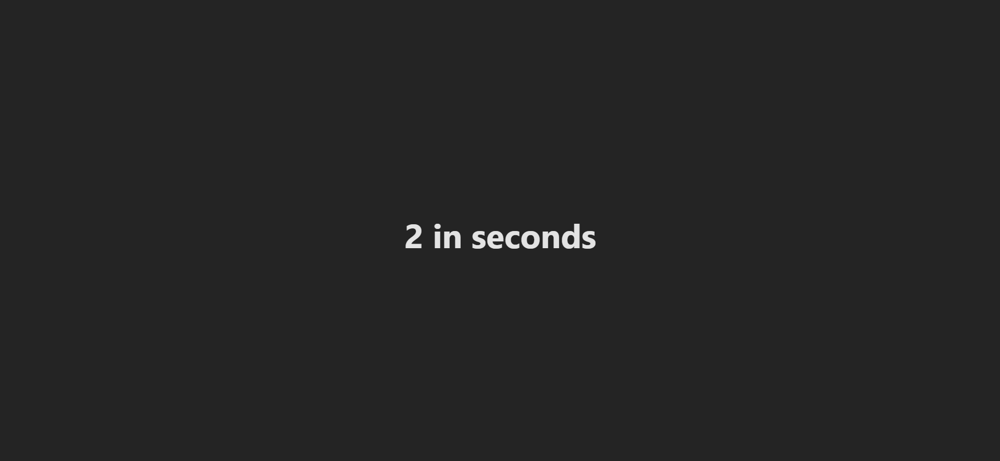

Increase timer every second using the latest state value (setTime(time => time + 1)). The clearInterval in the cleanup ensures the interval is cleared when the component unmounts, preventing memory leaks.

Output-

