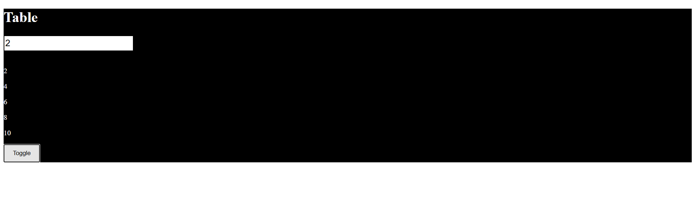

useCallback()

-It is used to return Memoize function

- Its useful for preventing functions from being re-created on re-rendering

difference between useMemo and useCallback is

1. useCallback return function where useMemo returns Memoize value
2. useCallback can pass value as parameter where useMemo cannot.

