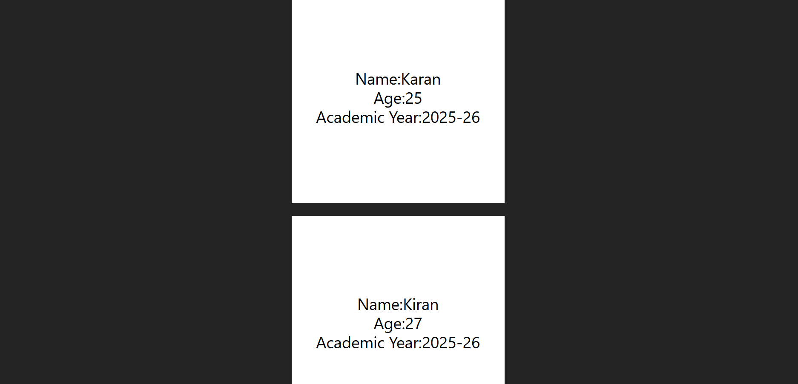

1.  App passes values like name, age, and academic year:

    `<Student username="Karan" age={25} Acadyr="2025-26" />`

2.  The Student component receives them through props and displays them inside the UI.

```function Student(props) {
 return (
 <>
 <div className='h-100 w-100 bg-white flex justify-center items-center'>
 <h1 className='text-black text-3xl'>
 Name:{props.username}
 <br />
 Age:{props.age}
 <br />
 Academic Year:{props.Acadyr}
 </h1>
 </div>
 </>
 );
 }```


